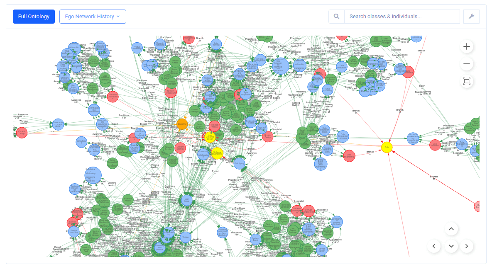

<a name="readme-top"></a>
<div align="center">
<h1>DDaT Ontology Modeller</h1>
<p>Automated parsing, and ontological & machine learning-powered semantic similarity modelling, of the Digital, Data and Technology (DDaT) profession capability framework website.</p>
<p><a href="https://ddat-capability-framework.service.gov.uk/" target="_blank">DDaT Capability Framework</a> · <a href="https://app.ontospark.com/?ontologyid=ddat" target="_blank">DDaT Ontology Visualisation</a></p>
</div>

|      |
|:--------------------------------------:|
| DDaT ontology visualisation in OntoSpark |
<br/>

## Table of Contents  
[1. Introduction](#introduction)<br/>
[2. Getting Started](#getting-started)<br/>
&nbsp;&nbsp;&nbsp;&nbsp;[2.1. Prerequisites](#prerequisites)<br/>
&nbsp;&nbsp;&nbsp;&nbsp;[2.2. Clone Source Code](#clone-source-code)<br/>
&nbsp;&nbsp;&nbsp;&nbsp;[2.3. Install Python Packages](#install-python-packages)<br/>
&nbsp;&nbsp;&nbsp;&nbsp;[2.4. Configuration](#configuration)<br/>
&nbsp;&nbsp;&nbsp;&nbsp;[2.5. Usage](#usage)<br/>
[3. License](#license)<br/>
[4. Acknowledgements](#acknowledgements)<br/>
[5. Useful Links](#useful-links)<br/>
[6. Authors](#authors)<br/>
<br/>

## <a name="introduction"></a>1. Introduction

The DDaT ontology modeller application is a Python application that automatically parses, and performs ontological and machine learning-powered semantic similarity modelling of, the <a href="https://ddat-capability-framework.service.gov.uk/" target="_blank">Digital, Data and Technology (DDaT) profession capability framework</a>. The goal of the resulting ontology is to enable effective <a href="https://app.ontospark.com/?ontologyid=ddat" target="_blank">visualisation</a> of the framework, and the goal of the machine-learning powered semantic similarity modelling is to identify potentially duplicate classes such as skills.

<p align="right"><a href="#readme-top">Back to Top &#9650;</a></p>

## <a name="getting-started"></a>2. Getting Started

### <a name="prerequisites"></a>2.1. Prerequisites

Please ensure that the following prerequisite software services are installed in your environment.

* **[Git](https://git-scm.com/)** - open source distributed version control system.
* **[Python 3](https://www.python.org/downloads/)** - Python 3 general-purpose programming language.
* **[ChromeDriver](https://googlechromelabs.github.io/chrome-for-testing/)** - WebDriver for Chrome.

<p align="right"><a href="#readme-top">Back to Top &#9650; </a></p>

### <a name="clone-source-code"></a>2.2. Clone Source Code

The open source code for this application may be found on GitHub at https://github.com/hyperlearningai/ddat-ontology-modeller. To clone the repository, please run the following Git command via your command line or preferred Git GUI tool. The base location of the cloned repository will hereafter be referred to as `$DDAT_ONTOLOGY_MODELLER_BASE`.

```
# Clone the GitHub public repository
$ git clone https://github.com/hyperlearningai/ddat-ontology-modeller

# Navigate into the base project folder
# This location will hereafter be referred to as $DDAT_ONTOLOGY_MODELLER_BASE
$ cd ddat-ontology-modeller
```

<p align="right"><a href="#readme-top">Back to Top &#9650;</a></p>

### <a name="install-python-packages"></a>2.3. Install Python Packages

The DDaT ontology modeller application requires the [Pandas](https://pypi.org/project/pandas/), [PyYAML](https://pypi.org/project/PyYAML/), [Selenium](https://pypi.org/project/selenium/) and [Sentence Transformers](https://pypi.org/project/sentence-transformers/) Python packages to be installed in the relevant Python 3 environment. To install these Python package dependencies, please do so either manually or via the `requirements.txt` in `$DDAT_ONTOLOGY_MODELLER_BASE` using `pip` in the relevant Python environment as follows:

```
# Install the required Python package dependencies in your active Python environment
$ pip install -r requirements.txt
```

<p align="right"><a href="#readme-top">Back to Top &#9650;</a></p>

### <a name="configuration"></a>2.4. Configuration

The DDaT ontology modeller application configuration may be found at `$DDAT_ONTOLOGY_MODELLER_BASE/ddat/config/config.yaml`. Please review and update the following configuration as required before running the application.

Property | Description
:--- | :---
`app.base_working_dir` | Absolute path to a readable and writeable local directory where the DDaT ontology will be written to as an OWL RDF/XML file, as well as other working and application log files.
`app.webdriver_paths.chromedriver` | Absolute path to the Google Chrome WebDriver (see [Prerequisites](#prerequisites)).

<p align="right"><a href="#readme-top">Back to Top &#9650;</a></p>

### <a name="usage"></a>2.5. Usage

To run the DDaT ontology modeller application, simply run `$DDAT_ONTOLOGY_MODELLER_BASE/main.py` as follows:

```
# Run the DDaT ontology modeller application
$ python main.py
```

<p align="right"><a href="#readme-top">Back to Top &#9650;</a></p>

## <a name="license"></a>3. License

The DDaT ontology modeller application source code is available and distributed under the MIT license. Please refer to [`LICENSE`](https://github.com/hyperlearningai/ddat-ontology-modeller/blob/main/LICENSE) for further information. The DDaT ontology created by the DDaT ontology modeller application contains public sector information licensed under the [Open Government License v3.0](https://www.nationalarchives.gov.uk/doc/open-government-licence/version/3/).

<p align="right"><a href="#readme-top">Back to Top &#9650;</a></p>

## <a name="acknowledgements"></a>4. Acknowledgements

The DDaT ontology created by the DDaT ontology modeller application contains public sector information sourced from the [Digital, Data and Technology (DDaT) profession capability framework](https://ddat-capability-framework.service.gov.uk/) which is maintained by the [Central Digital and Data Office (CDDO)](https://www.gov.uk/government/organisations/central-digital-and-data-office). The framework is publicly-available under the [Open Government License v3.0](https://www.nationalarchives.gov.uk/doc/open-government-licence/version/3/). 

<p align="right"><a href="#readme-top">Back to Top &#9650;</a></p>

## <a name="useful-links"></a>5. Useful Links

* [DDaT profession capability framework](https://ddat-capability-framework.service.gov.uk/)
* [DDaT ontology visualisation in OntoSpark](https://app.ontospark.com/?ontologyid=ddat)
* [DDaT ontology OWL RDF/XML file](https://github.com/hyperlearningai/ddat-ontology)
* [DDaT ontology in WebProtégé](https://webprotege.stanford.edu/#projects/a86cf6a3-c6f1-4dc8-a8db-b8be17e39736/edit/Classes)

<p align="right"><a href="#readme-top">Back to Top &#9650;</a></p>

## <a name="authors"></a>6. Authors

The DDaT ontology modeller application was developed by the following authors:

* **[Jillur Quddus](https://hyperlearning.ai/team/jillurquddus/)**<br/>Computational Mathematician

<p align="right"><a href="#readme-top">Back to Top &#9650;</a></p>
